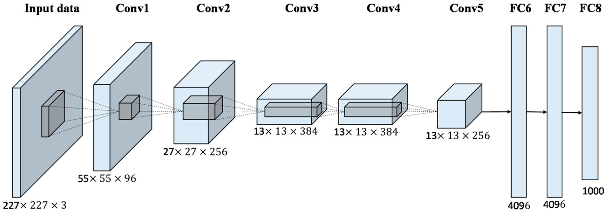

# AlexNet
In this notebook, I implement [AlexNet](https://papers.nips.cc/paper/4824-imagenet-classification-with-deep-convolutional-neural-networks.pdf) and use it on the [CIFAR](https://www.cs.toronto.edu/~kriz/cifar.html) dataset. It contains 60000 images of 32x32 pixels which belong to 10 classes namely;

AlexNet is a Convolutional Neural Network Architecture developed by Alex Krizhevsky, and published with Ilya Sutskever and Krizhevsky's doctoral advisor Geoffrey Hinton. It won the [ImagNet large scale Visual Recognition Challange](https://en.wikipedia.org/wiki/ImageNet#ImageNet_Challenge) in September 2012.

I get a test set accuracy of 82% after running 10 epochs on the data.